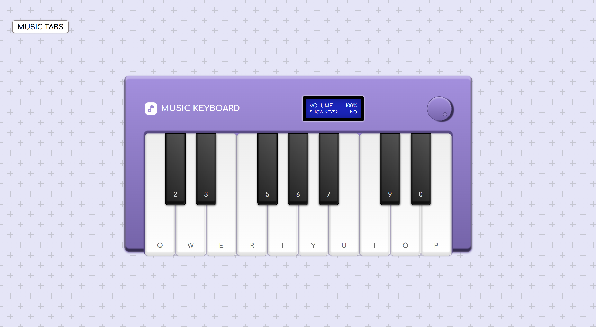

## 🎹 Virtual Keyboard  
A virtual piano built for fun and practice! You can play it by clicking the on-screen keys, or using your own keyboard — each key is mapped to a matching note.

Extra features include:
- 🎵 A floating music tabs menu, so you can follow and play tunes anytime  
- 🔤 Toggle between keyboard letters or note nomenclature (C, D, E...)  
- 🔊 Volume control knob to adjust the piano sound  

---

## 🧪 Technologies  
- HTML  
- CSS  
- JavaScript  

---

*Virtual Keyboard was developed during a Web Development Bootcamp by **[DIO](https://www.dio.me/).***
